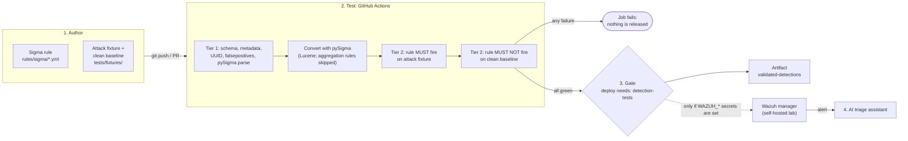
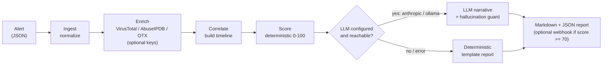

# Detection-as-Code Pipeline + AI Alert Triage Assistant

[](https://github.com/EduardoRochaFernandes/detection-as-code-pipeline/actions/workflows/ci.yml)
[](https://github.com/EduardoRochaFernandes/detection-as-code-pipeline/actions/workflows/test-and-deploy.yml)
[](https://github.com/EduardoRochaFernandes/detection-as-code-pipeline/actions/workflows/secret-scan.yml)
[](LICENSE)

[](https://codespaces.new/EduardoRochaFernandes/detection-as-code-pipeline)

**Detections treated as software: Sigma rules are version-controlled, automatically tested
against attack telemetry *and* a clean baseline, and only released if they pass a fail-closed
CI gate. A companion assistant turns a raw SIEM alert into a structured investigation report.**

Most junior blue-team portfolios are a static "home SOC lab": install Wazuh, add Sysmon,
screenshot a dashboard. This project wraps the same building blocks in an *engineering
process* (version control, true-positive and false-positive regression tests, a gate that
blocks untested rules), so it demonstrates **building** security tooling, not just using it.
It is a student/portfolio project that runs on a laptop with free, open-source software.

## Run it in one click

**GitHub Codespaces** (no install, no API keys): click the badge above, or
[open a Codespace](https://codespaces.new/EduardoRochaFernandes/detection-as-code-pipeline).
The dev container installs everything and runs the full test suite on start; then try the
demo below in the terminal.

**Locally** (Python 3.11+, nothing else, no accounts):

```bash
git clone https://github.com/EduardoRochaFernandes/detection-as-code-pipeline
cd detection-as-code-pipeline
pip install -r pipeline/requirements.txt -r triage-assistant/requirements.txt
make test      # schema, true-positive and false-positive tests, catalogue check, triage tests
make demo      # triage a bundled sample alert end-to-end, offline
```

No `make` (e.g. plain Windows)? The commands behind it are `python -m pytest` and
`cd triage-assistant && python -m app.main --alert sample_alerts/example_rdp_bruteforce_alert.json`.

The triage assistant needs **no API key**: without VirusTotal / AbuseIPDB / OTX / LLM keys it
skips enrichment and writes a deterministic, clearly-labelled report (`generated_by:
deterministic-fallback`). See [the demo output](#triage-assistant-demo) below. To use real
threat intel or an LLM, copy [`.env.example`](.env.example) to `.env` and add your own keys.

## How it works

Rule to test to gate to deploy, as wired in [`.github/workflows/`](.github/workflows):



The whole thesis is one line: in [`test-and-deploy.yml`](.github/workflows/test-and-deploy.yml)
the `deploy` job declares `needs: detection-tests` and `if: success()`, so a detection that
fails any test can never be released. Rules are evaluated by an in-memory Sigma matcher
([`pipeline/sigma_matcher.py`](pipeline/sigma_matcher.py)), so the whole suite runs in about a
second with no SIEM. Design notes and trade-offs: [docs/architecture.md](docs/architecture.md).

The triage assistant (`triage-assistant/`) is a second loop where **facts are computed by code
and the LLM only narrates them**:



A post-generation guard discards any LLM report that mentions an IPv4 address not present in
the input facts, and `generated_by` always records which path actually produced the report.

## Detection catalogue (MITRE ATT&CK)

Generated from the real rule files by [`pipeline/rule_catalogue.py`](pipeline/rule_catalogue.py);
CI fails if it goes stale. Full version: [docs/rule-catalogue.md](docs/rule-catalogue.md). Per-rule
scope and known gaps: [mitre_attack/coverage_map.md](mitre_attack/coverage_map.md).

<!-- RULES:START -->
**13 Sigma rules** covering **13 ATT&CK techniques** across **10 tactics**.

| ATT&CK | Tactic(s) | Detection | Severity | Log source | Type | Attack fixture |
|--------|-----------|-----------|----------|------------|------|:--------------:|
| [T1003.001](https://attack.mitre.org/techniques/T1003/001/) | Credential Access | [LSASS Memory Access / Dump (Credential Dumping)](rules/sigma/t1003_001_credential_dumping_lsass.yml) | critical | `windows / process_access` | single event | yes |
| [T1486](https://attack.mitre.org/techniques/T1486/) | Impact | [Mass File Rename to Ransom Extension (Possible Ransomware)](rules/sigma/t1486_ransomware_file_activity.yml) | critical | `windows / file_event` | threshold (count) | yes |
| [T1021.002](https://attack.mitre.org/techniques/T1021/002/) | Lateral Movement | [Lateral Movement via SMB Admin Shares](rules/sigma/t1021_002_lateral_movement_smb.yml) | high | `windows / process_creation` | single event | yes |
| [T1055](https://attack.mitre.org/techniques/T1055/) | Defense Evasion, Privilege Escalation | [Process Injection via CreateRemoteThread](rules/sigma/t1055_process_injection.yml) | high | `windows / create_remote_thread` | single event | yes |
| [T1059.001](https://attack.mitre.org/techniques/T1059/001/) | Execution | [Suspicious PowerShell Execution (Encoded / Download Cradle)](rules/sigma/t1059_001_suspicious_powershell.yml) | high | `windows / process_creation` | single event | yes |
| [T1070.001](https://attack.mitre.org/techniques/T1070/001/) | Defense Evasion | [Windows Event Log Cleared (Anti-Forensics)](rules/sigma/t1070_001_clear_event_logs.yml) | high | `windows` | single event | yes |
| [T1078](https://attack.mitre.org/techniques/T1078/) | Initial Access, Persistence | [Interactive Logon by Built-in / Service Account (Valid Account Misuse)](rules/sigma/t1078_valid_accounts_builtin_logon.yml) | high | `windows / security` | single event | yes |
| [T1110.001](https://attack.mitre.org/techniques/T1110/001/) | Credential Access | [Multiple Failed RDP Logons From a Single Source (Possible Brute Force)](rules/sigma/t1110_001_brute_force_rdp.yml) | high | `windows / security` | threshold (count) | yes |
| [T1053.005](https://attack.mitre.org/techniques/T1053/005/) | Persistence, Execution | [Scheduled Task Creation via schtasks / at](rules/sigma/t1053_005_scheduled_task.yml) | medium | `windows / process_creation` | single event | yes |
| [T1071.001](https://attack.mitre.org/techniques/T1071/001/) | Command and Control | [Suspicious Web User-Agent (Possible C2 Over HTTP/S)](rules/sigma/t1071_001_c2_beaconing_web.yml) | medium | `proxy` | single event | yes |
| [T1136.001](https://attack.mitre.org/techniques/T1136/001/) | Persistence | [Local Account Creation](rules/sigma/t1136_001_create_local_account.yml) | medium | `windows` | single event | yes |
| [T1547.001](https://attack.mitre.org/techniques/T1547/001/) | Persistence | [Registry Run Key Persistence](rules/sigma/t1547_001_registry_run_key_persistence.yml) | medium | `windows / registry_set` | single event | yes |
| [T1018](https://attack.mitre.org/techniques/T1018/) | Discovery | [Remote System Discovery (Network Enumeration)](rules/sigma/t1018_remote_system_discovery.yml) | low | `windows / process_creation` | single event | yes |
<!-- RULES:END -->

All rules are `status: experimental`. Whether a rule fires on its fixture and stays silent on the
clean baseline is decided by the test suite (see the CI badge), not by this table.

## Triage assistant demo

Real output of `cd triage-assistant && python -m app.main --alert sample_alerts/example_rdp_bruteforce_alert.json`
with no keys configured (abridged):

```text
[+] Report generated by: deterministic-fallback
[+] Composite score: 75/100  (requires_immediate_review=True)

# Investigation Report (automated first draft)
> Machine-generated. Requires analyst review before any action.

## 1. Summary
Alert **Possible RDP brute force: 8+ failed logons from one source** (severity `high`, technique
`T1110.001`) fired on host `WIN-EP-01` ... Deterministic composite score: **75/100**.

## 2. What happened
- `2026-07-04T09:15:05+00:00` EventID 4625 on WIN-EP-01
- `2026-07-04T09:15:19+00:00` **[TRIGGER]** Possible RDP brute force: 8+ failed logons from one source
- `2026-07-04T09:22:40+00:00` Lateral Movement via SMB Admin Shares

## 4. Threat intelligence context
Threat-intel enrichment was **offline** (no API keys configured); reputation data is unavailable.
```

## Repository layout

```text
rules/sigma/            13 Sigma detections (YAML) with ATT&CK tags and documented false positives
rules/converted/        build output of the converter (gitignored; CI uploads it as an artifact)
pipeline/               in-memory Sigma matcher, pySigma conversion, Wazuh deploy script,
                        Atomic Red Team runner, metrics, rule-catalogue generator
tests/                  3 tiers: rule syntax/metadata, fires-on-attack, silent-on-baseline
tests/fixtures/         per-rule attack telemetry + 5 clean-baseline files; tests/atomics_map.yml
triage-assistant/       ingest -> enrich -> correlate -> score -> report (+ its own tests)
mitre_attack/           per-rule methodology: what each rule covers and what it does not
docs/                   architecture, rule catalogue (generated), setup guide, lessons learned
docker-compose.yml      optional Wazuh lab (manager + indexer + dashboard)
.github/workflows/      ci.yml, test-and-deploy.yml (the gate), secret-scan.yml
.devcontainer/          one-click Codespaces environment
```

## Testing

```bash
python -m pytest                      # everything: pipeline tests + triage-assistant tests
make lint                             # ruff
python pipeline/compute_metrics.py    # coverage numbers -> metrics.json
```

CI ([`ci.yml`](.github/workflows/ci.yml)) runs lint, the full suite on Python 3.11 and 3.12, the
catalogue freshness check, and the offline triage demo on every push and pull request.
`secret-scan.yml` runs Gitleaks over the full git history.

## Limitations and honest status

- **Fixture-based testing, not a live SIEM.** Tests replay small normalized log fixtures through an
  in-memory matcher. That proves the mechanism and the gate; it does not model time windows or
  cross-event sequences (e.g. "failed logons then a success"), which are documented per rule as gaps.
- **Fixtures are small and curated** to mirror the Atomic Red Team tests listed in
  [`tests/atomics_map.yml`](tests/atomics_map.yml). `pipeline/run_atomics.py` can capture fresh telemetry
  from a Windows lab VM, but that path needs a lab and is not exercised in CI.
- **False-positive rates are not representative.** The clean baseline is a handful of tidy events;
  enterprise noise would require tuning (each rule lists its expected false positives).
- **Deployment is artifact-gated.** GitHub-hosted runners cannot reach a home lab, so CI publishes the
  validated rules as an artifact; pushing them to Wazuh needs a self-hosted runner or a manual
  `pipeline/deploy_rules.py` run against a lab. `rules/converted/wazuh/` currently holds only a README:
  Wazuh XML artifacts are not yet committed, and the Lucene converter skips the two `count()` rules.
- **AI output is a first draft.** The assistant augments a Tier-1 analyst and never decides an incident.
  The live Wazuh polling bridge (`poll_wazuh`) and the LLM/threat-intel paths need a lab or API keys and
  are not covered by the keyless tests.

## Roadmap

Live ephemeral-SIEM testing in CI (the matcher sits behind one seam, `pipeline/query_runner.py`) ·
self-hosted runner for automatic deploy · committed Wazuh XML artifacts · Sigma correlation rules for
the stateful detections · Zeek/Suricata network detections · ATT&CK Navigator layer · Ollama as the
default air-gapped LLM.

## Contributing and security

Issues and PRs are welcome; see [CONTRIBUTING.md](CONTRIBUTING.md). To report a vulnerability, see
[SECURITY.md](SECURITY.md). Some Atomic Red Team tests are disruptive: only run `run_atomics.py`
inside an isolated lab VM.

## License and author

[MIT](LICENSE). Built by [Eduardo Fernandes](https://github.com/EduardoRochaFernandes) as a
blue-team / DevSecOps portfolio project.
