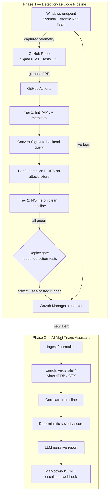

# Detection-as-Code Pipeline + AI Alert Triage Assistant

**Detections treated as software: version-controlled, automatically tested
against simulated MITRE ATT&CK attacks, and only deployed if they actually catch
the attack without false-alarming on normal activity — paired with an
AI-assisted triage tool that turns a raw alert into a structured investigation
report.**

Most junior blue-team portfolios are a static "home SOC lab": install Wazuh,
add Sysmon, screenshot a dashboard. This project reuses those same components but
wraps them in an *engineering process* — version control, automated true-positive
and false-positive testing, and a fail-closed CI/CD gate — so it demonstrates
**building** security tooling, not just using it. It runs on a single laptop with
free/open-source software.

> Status: Phase 1 pipeline is complete and green (80 automated checks). Phase 2
> triage assistant runs end-to-end offline. See [Limitations](#limitations--honest-trade-offs)
> for what is real vs. ready-to-run-once-lab-is-up.

## Architecture

Two coordinated subsystems covering the full defensive loop: **write detections →
prove they work → deploy → catch an alert → investigate → document.**


Full write-up: [docs/architecture.md](docs/architecture.md).

## Quickstart (no lab required — reproduces the pipeline in a minute)

```bash
git clone <repo-url> && cd detection-as-code-pipeline
python -m pip install -r pipeline/requirements.txt
python -m pytest tests/ -v            # 80 checks: syntax + true-positive + false-positive
python pipeline/compute_metrics.py    # coverage metrics -> metrics.json
```
Then the triage assistant, fully offline:
```bash
python -m pip install -r triage-assistant/requirements.txt
cd triage-assistant && python -m app.main --alert sample_alerts/example_rdp_bruteforce_alert.json
```
Full lab bring-up (Wazuh + Sysmon endpoint + Atomic Red Team):
[docs/setup-guide.md](docs/setup-guide.md).

## What's inside
| Directory | Purpose |
|-----------|---------|
| [`rules/sigma/`](rules/sigma) | 13 Sigma detections, full metadata, mapped to ATT&CK |
| [`pipeline/`](pipeline) | In-memory Sigma matcher, conversion, deploy, atomic orchestration, metrics |
| [`tests/`](tests) | 3 test tiers + captured attack fixtures + clean baselines |
| [`.github/workflows/`](.github/workflows) | Validate, test-and-deploy (fail-closed), secret scan |
| [`triage-assistant/`](triage-assistant) | Phase 2 AI triage tool |
| [`mitre_attack/`](mitre_attack/coverage_map.md) | Coverage map + per-rule methodology |
| [`docs/`](docs) | Architecture, setup, lessons learned |

## MITRE ATT&CK coverage
13 techniques across 10 tactics; **13/13** rules passing true-positive and
false-positive tests. Full table + methodology:
[mitre_attack/coverage_map.md](mitre_attack/coverage_map.md).

| Technique | Name | Tactic | Status |
|-----------|------|--------|--------|
| T1110.001 | RDP brute force | Credential Access | ✅ Test Passing |
| T1059.001 | Suspicious PowerShell | Execution | ✅ Test Passing |
| T1003.001 | LSASS credential dumping | Credential Access | ✅ Test Passing |
| T1547.001 | Registry Run key persistence | Persistence | ✅ Test Passing |
| T1021.002 | SMB admin-share lateral movement | Lateral Movement | ✅ Test Passing |
| T1053.005 | Scheduled task | Persistence | ✅ Test Passing |
| T1070.001 | Clear event logs | Defense Evasion | ✅ Test Passing |
| T1078 | Valid-account misuse | Initial Access | ✅ Test Passing |
| T1071.001 | Suspicious web UA (C2) | Command & Control | ✅ Test Passing |
| T1136.001 | Local account creation | Persistence | ✅ Test Passing |
| T1486 | Ransomware file impact | Impact | ✅ Test Passing |
| T1018 | Remote system discovery | Discovery | ✅ Test Passing |
| T1055 | Process injection | Defense Evasion | ✅ Test Passing |

## How the pipeline enforces quality
When you `git push` a new or changed Sigma rule:
1. **Tier 1 (unit)** — every rule must parse (structural + real pySigma) and
   carry all required metadata, including a non-empty `falsepositives` block.
2. **Convert** — Sigma is compiled to backend queries (Lucene / native Wazuh XML).
3. **Tier 2 true-positive** — the rule is replayed against telemetry captured
   from the matching Atomic Red Team test; it **must fire**.
4. **Tier 2 false-positive** — the rule is replayed against a clean baseline of
   normal activity; it **must not fire**.
5. **Deploy gate** — the `deploy` job declares `needs: detection-tests` and
   `if: success()`. **A detection that fails any test can never reach the SIEM.**

That last line is the entire thesis. Evaluation runs through an in-memory Sigma
matcher (`pipeline/sigma_matcher.py`) so the whole suite finishes in under a
second in CI with no live SIEM — see [docs/architecture.md](docs/architecture.md)
for why, and how to upgrade to live ephemeral-SIEM testing.

## Demo
_90-second screen recording placeholder_ (shot list in the project brief,
Section 9.3): edit a rule → push → CI runs green → trigger the atomic → alert
fires in Wazuh → triage report is generated. Add the GIF at `docs/images/demo.gif`
once recorded.

## Limitations & honest trade-offs
- **Fixture-based CI, not a live SIEM (yet).** Tests use an in-memory matcher
  over captured/normalized telemetry. This proves the *mechanism*; it does not
  model time-window or cross-event sequence correlation. Upgrading to an
  ephemeral OpenSearch container in CI is a one-function change (roadmap).
- **Home-lab false-positive rates are not representative** of enterprise noise.
  Several rules would need tuning against real traffic.
- **Deployment is artifact-gated, not cloud-automated.** GitHub-hosted runners
  can't reach a laptop lab, so CI publishes a validated artifact and deploy is
  local / self-hosted-runner. Stated plainly, not faked.
- **AI reports require human review** and never decide an incident (Phase 2 is a
  Tier-1 augmentation).

## Roadmap
Live ephemeral-SIEM CI testing · self-hosted runner for auto-deploy · Zeek/Suricata
network detections · ATT&CK Navigator heat-map from the coverage map · Ollama as
the default (air-gapped) LLM · Trivy container scanning · Sigma correlation rules
for the stateful detections currently out of scope.

## Résumé bullets & pitch
See [docs/lessons-learned.md](docs/lessons-learned.md) and the project brief's
Section 10. 30-second pitch: *"I treat detection rules like software — every rule
is version-controlled, automatically tested against a real simulated attack with
Atomic Red Team, and only deployed if it catches the attack without false-alarming
on normal activity. On top I built an AI assistant that enriches any alert, builds
a timeline, and drafts an investigation report."*

## License
[MIT](LICENSE). Feedback and PRs welcome. Built by Eduardo Fernandes as a
blue-team / DevSecOps portfolio project.
