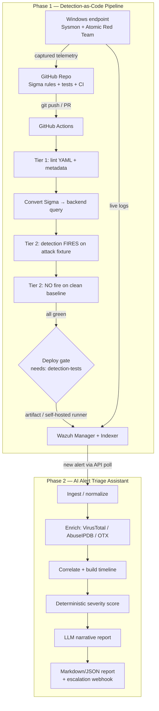

# Architecture

Two coordinated subsystems that together cover the full defensive loop:
**write detections → prove they work → deploy → catch an alert → investigate → document.**

## The one line that is the whole thesis

In `.github/workflows/test-and-deploy.yml` the `deploy` job declares
`needs: detection-tests` and `if: success()`. An untested or broken detection
therefore **cannot** reach the SIEM. Everything else supports that guarantee.

## Why an in-memory matcher for CI (strategy 1)

The tests need to answer "does this rule fire on this telemetry?" without a live
SIEM inside GitHub Actions. `pipeline/sigma_matcher.py` parses the Sigma
`detection` block and evaluates it directly against normalized JSON log fixtures.
Benefits: the whole suite runs in <1s with only `pyyaml`, and it is fully
auditable. Trade-off: it models the *matching* semantics of Sigma (selections,
modifiers, boolean conditions, simple `count() by` aggregation) but **not**
time-window or cross-event sequence correlation — those are explicitly out of
scope and handled at the SIEM/correlation layer.

`pipeline/query_runner.run_query_against_fixture` is the single seam between the
tests and the evaluation strategy. Upgrading to **strategy 2** (spin up an
ephemeral OpenSearch container in CI, bulk-load fixtures, run the real converted
query) changes only that function — the tests stay identical. That upgrade is on
the roadmap.

## Fixture normalization

Raw `Get-WinEvent`/Sysmon JSON is deeply nested. `run_atomics.py` captures it as
`*.raw.json` (gitignored); a normalization pass flattens each event into the
field shape the rules reference (`EventID`, `Image`, `CommandLine`,
`TargetObject`, `UserAgent`, ...). The committed fixtures under
`tests/fixtures/` are the normalized form, which keeps the matcher small and the
rules readable. This is a deliberate simplification, documented here rather than
hidden.

## Wazuh XML vs Lucene conversion

Wazuh's native rule format is OSSEC XML, not Lucene. We therefore treat the
hand-maintained Wazuh XML (`rules/converted/wazuh/`) as the deployable
"compiled" artifact kept in sync with the Sigma source, while
`pipeline/convert_rules.py` additionally emits Lucene for portability/portfolio
breadth. Inline-aggregation rules don't render to stateless Lucene and are
reported as skipped by the converter — expected, not a bug.
